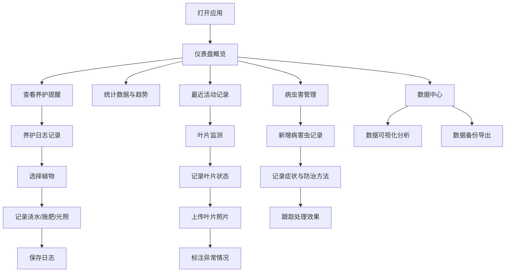

## 1. 产品概述

植物病虫害观察日志应用是一款专为阳台种植及园艺爱好者设计的专业养护记录工具。通过系统化的日常养护记录、叶片形态监测和病虫害追踪，帮助用户科学管理植物健康，提升园艺种植成功率。

- 目标用户：阳台种植爱好者、家庭园艺爱好者、植物养护初学者
- 核心价值：提供结构化的植物健康记录体系，可视化生长趋势，辅助病虫害早期发现与科学防治

## 2. 核心功能

### 2.1 用户角色

| 角色 | 注册方式 | 核心权限 |
|------|---------|---------|
| 普通用户 | 无需注册，本地存储 | 完整使用所有功能，本地数据管理 |

### 2.2 功能模块

1. **仪表盘页面**：植物概览统计、最近养护提醒、生长趋势图表、病虫害预警
2. **植物管理页面**：植物列表、新增/编辑/删除植物、按种类分类筛选、植物详情页
3. **养护日志页面**：记录浇水/施肥/光照信息、日志时间线、养护历史查询
4. **叶片监测页面**：叶片状态记录、异常情况标注（颜色/斑点/卷曲）、图片附件上传
5. **病虫害管理页面**：病虫害记录、防治方法、处理效果跟踪、历史案例查询
6. **数据中心页面**：数据可视化图表、数据备份与恢复、数据导出（JSON/CSV）

### 2.3 页面详情

| 页面名称 | 模块名称 | 功能描述 |
|---------|---------|---------|
| 仪表盘 | 统计卡片 | 展示植物总数、本月养护次数、活跃病虫害数量、健康植物比例 |
| 仪表盘 | 趋势图表 | 近30天浇水/施肥频次折线图、植物健康状态分布饼图 |
| 仪表盘 | 最近活动 | 展示最近5条养护记录和病虫害记录 |
| 仪表盘 | 养护提醒 | 根据养护周期提示需要浇水/施肥的植物 |
| 植物管理 | 植物列表 | 卡片式展示所有植物，支持按种类/健康状态筛选 |
| 植物管理 | 新增植物 | 表单录入植物名称、种类、种植日期、位置、备注 |
| 植物管理 | 植物详情 | 展示植物基本信息、养护日志时间线、叶片记录、病虫害记录 |
| 养护日志 | 日志记录 | 记录浇水时间与量、施肥种类与量、光照时长与强度 |
| 养护日志 | 日志列表 | 按时间倒序展示所有养护记录，支持按植物筛选 |
| 叶片监测 | 状态记录 | 记录叶片颜色变化、斑点、卷曲等异常，支持多图上传 |
| 叶片监测 | 图片画廊 | 网格展示所有叶片照片，支持大图预览和时间对比 |
| 病虫害管理 | 病害虫记录 | 记录类型、发现日期、严重程度、症状描述、防治方法 |
| 病虫害管理 | 效果跟踪 | 记录处理后的效果评估、复查日期、最终结果 |
| 数据中心 | 数据可视化 | 按植物展示养护趋势、健康评分变化曲线 |
| 数据中心 | 数据备份 | 一键导出全部数据为JSON文件，支持从JSON文件恢复 |
| 数据中心 | 数据导出 | 选择数据类型导出CSV格式（养护记录/病虫害记录） |

## 3. 核心流程

用户打开应用后，首先在仪表盘查看整体植物状态和养护提醒。当需要记录日常养护时，进入养护日志页面选择植物并填写浇水/施肥/光照信息。观察到叶片异常时，在叶片监测页面记录状态并上传照片。发现病虫害时，创建病虫害记录并持续跟踪防治效果。定期在数据中心进行数据备份和查看生长趋势分析。

## 4. 用户界面设计

### 4.1 设计风格

- **主色调**：自然绿色系（深绿 #2D5016 作为主色，浅绿 #8CB369 作为辅助色），搭配暖土色（#C9A96E）作为点缀
- **辅助色**：健康状态用绿色渐变，警告状态用琥珀色，异常状态用柔和的橙红色
- **按钮风格**：圆角胶囊按钮（border-radius: 9999px），带有微妙的悬停动效和阴影变化
- **字体**：标题使用 "Noto Serif SC" 衬线字体，正文使用 "Noto Sans SC" 无衬线字体，营造自然优雅的阅读体验
- **布局风格**：左侧固定导航栏 + 右侧内容区的经典管理后台布局，卡片式内容容器，充足的留白
- **图标风格**：使用 Lucide React 线性图标，配合自然主题的 emoji 装饰（🌿、🌱、🍃、🐛）
- **背景质感**：轻微的纸张纹理背景，卡片使用柔和的米色/浅绿色渐变，营造自然手账氛围

### 4.2 页面设计概览

| 页面名称 | 模块名称 | UI 元素 |
|---------|---------|---------|
| 仪表盘 | 统计卡片 | 渐变背景卡片，数字动画计数，左侧彩色竖条标识，图标装饰 |
| 仪表盘 | 趋势图表 | 平滑折线图，渐变填充区域，悬浮数据提示 |
| 仪表盘 | 最近活动 | 时间线样式，图标节点，植物名称标签，相对时间显示 |
| 植物管理 | 植物卡片 | 圆角卡片，植物头像/emoji，健康状态彩色标签，悬浮上浮动效 |
| 植物详情 | 时间线 | 垂直时间线，节点图标区分日志类型，展开/收起详情 |
| 养护日志 | 记录表单 | 分区块表单，图标选择器，滑块控件（光照强度/浇水量），日期时间选择器 |
| 叶片监测 | 图片画廊 | 响应式网格布局，方形图片卡片，悬浮显示日期和标注标签 |
| 病虫害管理 | 严重程度 | 彩色进度条标识，从绿色到红色渐变，状态徽章 |
| 数据中心 | 备份卡片 | 大图标卡片，拖拽上传区域，进度条动画 |

### 4.3 响应式设计

- 桌面端优先设计（≥1024px）：左侧固定导航（240px宽度）+ 主内容区
- 平板端（768px-1023px）：导航栏折叠为可展开侧栏，内容区自适应
- 移动端（<768px）：底部Tab导航，内容区单列布局，卡片全宽展示
- 触摸优化：按钮最小触控区域 44x44px，手势滑动切换标签页

### 4.4 动效设计

- 页面加载：内容区渐入 + 轻微上移（fadeInUp）
- 卡片悬浮：向上移动 4px + 阴影增强，过渡时长 200ms
- 数据更新：数字滚动动画，图表数据点弹性动画
- 表单交互：输入框聚焦时边框高亮过渡，按钮点击缩放反馈
- 模态框：从中心缩放出现 + 背景模糊遮罩渐变
