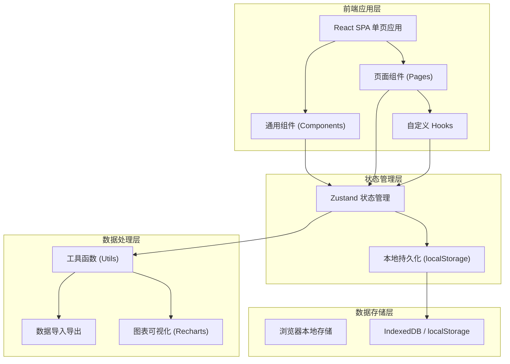
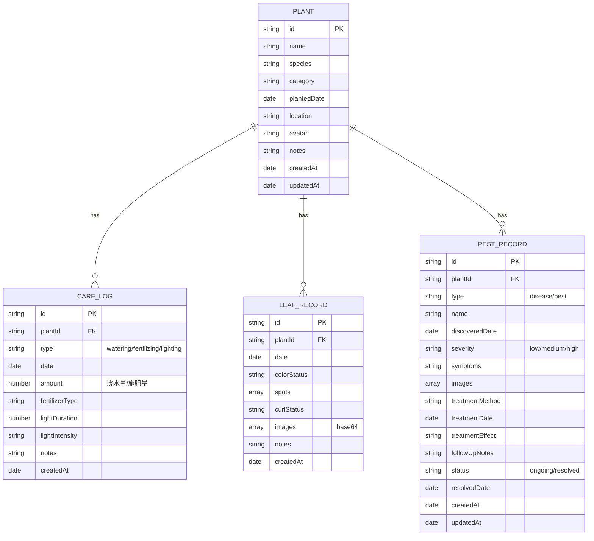

## 1. 架构设计



## 2. 技术描述

- **前端框架**：React@18 + TypeScript@5
- **构建工具**：Vite@5
- **样式方案**：Tailwind CSS@3 + CSS Variables
- **路由管理**：React Router DOM@6
- **状态管理**：Zustand@4（带 persist 中间件本地持久化）
- **图表可视化**：Recharts@2
- **图标库**：Lucide React@0.344
- **数据存储**：localStorage（JSON序列化），图片使用 Base64 内联存储
- **数据导出**：原生 Blob API 实现 JSON/CSV 导出
- **后端服务**：无（纯前端应用，所有数据本地存储）
- **初始化工具**：vite-init

## 3. 路由定义

| 路由路径 | 页面名称 | 用途说明 |
|---------|---------|---------|
| / | 仪表盘 | 植物状态概览、统计数据、趋势图表、最近活动 |
| /plants | 植物列表 | 所有植物展示、分类筛选、搜索 |
| /plants/new | 新增植物 | 创建新植物档案 |
| /plants/:id | 植物详情 | 单个植物的完整信息、养护日志、叶片记录、病虫害记录 |
| /plants/:id/edit | 编辑植物 | 修改植物基本信息 |
| /care-logs | 养护日志 | 所有养护记录列表、筛选查询 |
| /care-logs/new | 新增养护日志 | 记录浇水、施肥、光照信息 |
| /leaves | 叶片监测 | 叶片状态记录列表、图片画廊 |
| /leaves/new | 新增叶片记录 | 记录叶片状态、上传图片、标注异常 |
| /pests | 病虫害管理 | 病虫害记录列表、严重程度筛选 |
| /pests/new | 新增病虫害记录 | 记录病害虫信息、防治方法、效果跟踪 |
| /pests/:id | 病虫害详情 | 单个病虫害完整记录和跟踪历史 |
| /data | 数据中心 | 数据可视化分析、备份恢复、数据导出 |

## 4. API 定义（无后端）

纯前端应用，无后端 API。所有数据通过 Zustand store 进行管理，使用 localStorage 进行持久化。

## 5. 数据模型

### 5.1 数据模型定义



### 5.2 TypeScript 类型定义

```typescript
export interface Plant {
  id: string;
  name: string;
  species: string;
  category: string;
  plantedDate: string;
  location: string;
  avatar: string;
  notes: string;
  createdAt: string;
  updatedAt: string;
}

export type CareLogType = 'watering' | 'fertilizing' | 'lighting';
export type LightIntensity = 'low' | 'medium' | 'high';

export interface CareLog {
  id: string;
  plantId: string;
  type: CareLogType;
  date: string;
  amount?: number;
  fertilizerType?: string;
  lightDuration?: number;
  lightIntensity?: LightIntensity;
  notes: string;
  createdAt: string;
}

export type LeafColor = 'normal' | 'yellowing' | 'browning' | 'spotting' | 'wilting';
export type LeafCurl = 'none' | 'slight' | 'moderate' | 'severe';

export interface LeafRecord {
  id: string;
  plantId: string;
  date: string;
  colorStatus: LeafColor;
  spots: SpotInfo[];
  curlStatus: LeafCurl;
  images: string[];
  notes: string;
  createdAt: string;
}

export interface SpotInfo {
  type: string;
  color: string;
  size: string;
  description: string;
}

export type PestType = 'disease' | 'pest';
export type Severity = 'low' | 'medium' | 'high';
export type PestStatus = 'ongoing' | 'resolved';

export interface PestRecord {
  id: string;
  plantId: string;
  type: PestType;
  name: string;
  discoveredDate: string;
  severity: Severity;
  symptoms: string;
  images: string[];
  treatmentMethod: string;
  treatmentDate: string;
  treatmentEffect: string;
  followUpNotes: string;
  status: PestStatus;
  resolvedDate?: string;
  createdAt: string;
  updatedAt: string;
}
```

### 5.3 Zustand Store 结构

```typescript
interface AppState {
  plants: Plant[];
  careLogs: CareLog[];
  leafRecords: LeafRecord[];
  pestRecords: PestRecord[];
  
  // Plant actions
  addPlant: (plant: Omit<Plant, 'id' | 'createdAt' | 'updatedAt'>) => void;
  updatePlant: (id: string, data: Partial<Plant>) => void;
  deletePlant: (id: string) => void;
  getPlantById: (id: string) => Plant | undefined;
  
  // CareLog actions
  addCareLog: (log: Omit<CareLog, 'id' | 'createdAt'>) => void;
  updateCareLog: (id: string, data: Partial<CareLog>) => void;
  deleteCareLog: (id: string) => void;
  getCareLogsByPlant: (plantId: string) => CareLog[];
  
  // LeafRecord actions
  addLeafRecord: (record: Omit<LeafRecord, 'id' | 'createdAt'>) => void;
  updateLeafRecord: (id: string, data: Partial<LeafRecord>) => void;
  deleteLeafRecord: (id: string) => void;
  getLeafRecordsByPlant: (plantId: string) => LeafRecord[];
  
  // PestRecord actions
  addPestRecord: (record: Omit<PestRecord, 'id' | 'createdAt' | 'updatedAt'>) => void;
  updatePestRecord: (id: string, data: Partial<PestRecord>) => void;
  deletePestRecord: (id: string) => void;
  getPestRecordsByPlant: (plantId: string) => PestRecord[];
  
  // Data actions
  exportData: () => string;
  importData: (json: string) => void;
  clearAllData: () => void;
}
```

## 6. 项目目录结构

```
lyt-14/
├── src/
│   ├── components/           # 通用组件
│   │   ├── Layout/           # 布局组件（导航、侧边栏、页头）
│   │   ├── UI/               # 基础UI组件（卡片、按钮、表单、模态框）
│   │   ├── Charts/           # 图表组件
│   │   └── common/           # 其他通用组件
│   ├── pages/                # 页面组件
│   │   ├── Dashboard/        # 仪表盘
│   │   ├── Plants/           # 植物管理
│   │   ├── CareLogs/         # 养护日志
│   │   ├── Leaves/           # 叶片监测
│   │   ├── Pests/            # 病虫害管理
│   │   └── DataCenter/       # 数据中心
│   ├── hooks/                # 自定义 Hooks
│   ├── store/                # Zustand 状态管理
│   ├── types/                # TypeScript 类型定义
│   ├── utils/                # 工具函数
│   │   ├── format.ts         # 日期/数字格式化
│   │   ├── export.ts         # 数据导入导出
│   │   └── helpers.ts        # 辅助函数
│   ├── App.tsx               # 应用根组件
│   ├── main.tsx              # 入口文件
│   └── index.css             # 全局样式 + Tailwind 配置
├── .trae/
│   └── documents/            # 项目文档
├── index.html
├── package.json
├── vite.config.ts
├── tailwind.config.js
├── tsconfig.json
└── postcss.config.js
```
